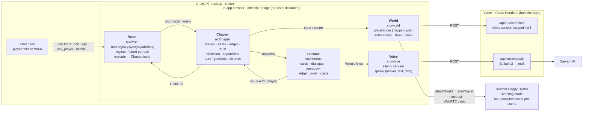

# After the Bridge

**A one-chapter survival story you play with an AI companion who has a body, a memory, and the right to say no.**

Submission for [The WebMCP Challenge](https://webmcp.devpost.com/). Built with Next.js on Vercel, [WebMCP](https://developer.chrome.com/docs/ai/webmcp), [Reactor Happy Oyster](https://docs.reactor.inc) for the live-generated world, and [Sarvam Bulbul](https://docs.sarvam.ai) for the companion's voice.

---

## What it is

You are a survivor. You travel with **Wren**. Wren is not a scripted character: she is an AI agent (Codex, in the ChatGPT desktop app) playing a role. The only way she can act is through the WebMCP tools this page registers.

That single idea drives everything:

| In the story | On the page |
|---|---|
| Wren gets hurt | the `run` tool is unregistered |
| You take the crowbar from her | the `open` tool disappears |
| You break her trust | `follow_my_lead` vanishes, and `decide` can come back **refused**, citing the exact moment in her ledger |
| Wren asks you a question | the `ask_player` tool blocks, a countdown runs on screen, and silence is an answer |
| Wren wants to know what's out there | she has to `look`, because the video is on your screen, not hers, and looking costs story time |

The world is generated live, one scene at a time, by a Reactor Directing world model. There is no pre-recorded footage. Every scene is a three-minute live travel, and the countdown in the corner is the stream's remaining time. When the light goes, the scene ends.

Three scenes, two endings, about eight minutes. Playable alone with cards, or with Wren through Codex. Cards and tools are the same input.

## Play it

**Live:** _URL added after deploy._

**With Wren (recommended):**

1. Open the ChatGPT desktop app and start a Codex session with the in-app browser.
2. Load the live URL. Site tools appear in the composer as soon as the page loads.
3. Click **Copy opening prompt** on the title card, paste it to Codex, and press **Begin**.
4. Talk to Wren. Watch the Site tools popover change as things happen to her. Open **Ledger** at any time to see what she remembers and what she can currently do.

**Without Wren:** press **Begin** and play the cards. Same story, same consequences.

**The two endings**, for testers who want to see both:

- *Together*: stay silent at the underpass, let Wren open the cabinet, go first at the bridge and call her across.
- *Alone*: send Wren to look at the underpass (she comes back wounded), take the crowbar from her at the pharmacy, go first at the bridge and call her across. She refuses, and says why.

## How WebMCP is used

The [WebMCP explainer](https://github.com/webmachinelearning/webmcp) describes a shared page where the human and the agent both have **visibility, history, and control**. This project treats those three words as game mechanics.

- **Dynamic registration is narrative state.** Desired capabilities are a pure function of the story snapshot. One `AbortController` per tool; aborting unregisters. Unchanged tools keep their controller so in-flight calls survive. If the tool list never changed, the project would have failed.
- **Blocking `execute` is a dramatic device.** `ask_player` waits on the page's UI and honours the agent's `AbortSignal`. Timeout resolves to `"silence"`, which the ledger records and which costs trust.
- **The page owns what the agent cannot see.** The live travel is a `<video>` over WebRTC. Wren's `look` returns authored text and spends a beat.
- **`execute` has standing.** `decide` may return `{ refused: true, reason, citation }`. There is no `refuse` tool; refusal is an outcome computed from the ledger.
- **One code path.** Every `execute` handler is a single call into the Chapter. Choice cards call the same function. No rule is duplicated for the agent.
- **Chrome's tool guidance, followed.** One function per tool, verbs that say what happens, positive descriptions, validation in code, `readOnlyHint` on perception tools. Wren's persona lives in the prompt the player pastes, never in the tool text.

### Wren's tools

| Tool | Read-only | Registered when |
|---|---|---|
| `get_scene_state` | yes | always |
| `recall` | yes | always |
| `listen` | yes | until the chapter ends |
| `look` | no (costs a beat) | until the chapter ends |
| `say` | | always |
| `ask_player` | | until the chapter ends |
| `decide` | | a situation is open |
| `move_to` | | the situation is resolved and exits exist |
| `hide` | | until the chapter ends |
| `run` | | Wren is not wounded |
| `open` | | Wren holds the crowbar and something here is locked |
| `give` | | Wren is carrying something |
| `take` | | the player is carrying something |
| `follow_my_lead` | | trust is at or above the threshold |

Every tool returns the same shape: `{ ok, narration, refused?, reason?, citation?, error?, state }`.

## Architecture



Five modules, one seam each. The Chapter never imports WebMCP or Reactor. Chrome never imports an SDK. Token minting and the Sarvam key are implementation details inside their adapters, not modules. See [CONTEXT.md](CONTEXT.md) for the vocabulary, [docs/adr](docs/adr) for the decisions, and [docs/RUBRIC.md](docs/RUBRIC.md) for how each judging criterion is meant to be demonstrated.

```
app/                     Next.js composition: page, Game.tsx, API routes
src/chapter/             story engine (types, scenes, capabilities, tests)
src/wren/                WebMCP registry + tool definitions (tests)
src/world/               placeholder + Happy Oyster adapters
src/voice/               silent + Sarvam adapters
src/chrome/              player-facing UI
docs/                    RUBRIC.md, ADRs
```

## Run it locally

Requirements: Node 20+, npm.

```bash
npm install
cp .env.example .env      # add your keys
npm run dev               # http://localhost:3000
```

| Variable | Purpose |
|---|---|
| `REACTOR_API_KEY` | Server-side only. Mints short-lived, session-scoped JWTs. Without it the page runs the placeholder World. |
| `REACTOR_WORLD_IDS` | Optional JSON `{"underpass":"…","pharmacy":"…","bridge":"…"}`. Pins the three persistent worlds so visitors attach instead of building. Ids are logged to the console the first time each scene is created. |
| `SARVAM_API_KEY` | Server-side only. Enables Wren's voice. Without it the silent adapter is used. |

Useful URLs while developing: `/?world=placeholder` forces the placeholder World; `/?begin=1` skips the title card.

```bash
npm test          # Chapter and Wren tests (vitest)
npm run typecheck
npm run lint
npm run build
```

No secret is ever prefixed `NEXT_PUBLIC_`; both keys live only in Route Handlers.

## Why it matters

Choice-driven games are expensive because every authored branch multiplies writing, art, voice, and QA. The usual answer to "an AI companion" is a chatbot with a prompt: no body, no inspectable memory, nothing the player can point to.

Here the writer authors a *situation*: a scene, its exits, and the capabilities that exist in it. The branch is computed. Wounded is not a line of dialogue, it is a missing tool the player can see. A refusal is not a scripted beat, it is a rule over a ledger the player can read. That is what WebMCP makes possible that a backend MCP server cannot: the human and the agent share one page, and the page has the final say.

## License

[MIT](LICENSE)
